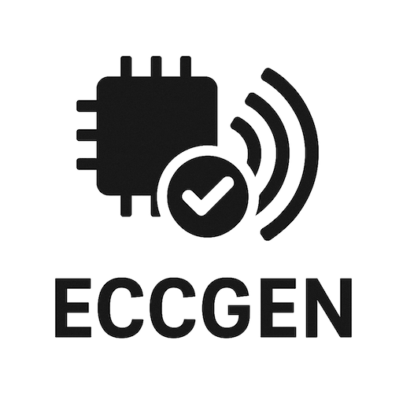

= ECCGen: Error Correcting Code Generator

:ecc: https://en.wikipedia.org/wiki/Error_correction_code
:secded: https://en.wikipedia.org/wiki/Hamming_code
:hsiao1970: https://ieeexplore.ieee.org/abstract/document/5391627
:chen2008: https://arxiv.org/pdf/0803.1217
:bcr: https://registry.bazel.build/

image:https://github.com/xlsynth/eccgen/actions/workflows/ci.yml/badge.svg?branch=main["CI", link="https://github.com/xlsynth/eccgen/actions/workflows/ci.yml"]

A Python tool that solves for a valid {ecc}[ECC^] construction given some input parameters and writes the generator (`G`) and parity-check (`H`) matrices to plain text output files.
You can use the generator matrix to implement an encoder and the parity-check matrix to implement the complementary decoder.

== Usage with Python

Setup:

[source,shell]
----
python3 -m venv ~/.virtualenvs/eccgen
source ~/.virtualenvs/eccgen/bin/activate
pip install -r requirements_3_12.in
----

Verbose args:

[source,shell]
----
python3 -m eccgen.eccgen --help
python3 -m eccgen.eccgen --scheme hsiao_secded --message-size 42 --generator-matrix-output $(pwd)/G.txt --parity-check-matrix-output $(pwd)/H.txt
----

Or with concise args:

[source,shell]
----
python3 -m eccgen.eccgen -h
python3 -m eccgen.eccgen -s hsiao_secded -k 42 -G $(pwd)/G.txt -H $(pwd)/H.txt
----

You can find pre-generated G-H pairs for powers-of-2 message and codeword sizes in `eccgen/matrices`.

== Usage with Bazel

You can use Bazel to run and test the tool, as well as depend on it from your own Bazel-based projects with Bzlmod.

Run the tool:

[source,shell]
----
bazel run //eccgen:eccgen -- --scheme hsiao_secded --message-size 42 --generator-matrix-output $(pwd)/G.txt --parity-check-matrix-output $(pwd)/H.txt
----

Run the unit tests:

[source,shell]
----
bazel test //...
----

To depend on the tool from your own Bazel-based project, add the following to your `MODULE.bazel` file:

[source,starlark]
----
bazel_dep(name = "eccgen", version = "0.1.0")
git_override(
    module_name = "eccgen",
    commit = <FILL IN SHA HERE>,
    remote = "https://github.com/xlsynth/eccgen",
)
----

(At some point, we'll publish to the {bcr}[Bazel Central Registry^].)

== Hsiao codes

Currently, the tool only supports {hsiao1970}[Hsiao] single-error-correcting, double-error-detecting ({secded}[SECDED^]) codes, which are commonly found in digital circuit designs.
(The tool can be extended to support other codes.)

The Hsiao code solver is based on the algorithms from the following papers:

* {hsiao1970}[Hsiao et. al. 1970^]
* {chen2008}[Chen et. al. 2008^]

We only use the optimal solver up to `k = 256`; beyond that, we use a greedy solution which is still SECDED, but doesn't qualify as a Hsiao code.

== Contributing

We welcome your contributions!
Please feel free to open an issue or submit a pull request.

We use GitHub Actions for CI: we run the pre-commit checks and all the Bazel tests.

== License

This project is licensed under the Apache License 2.0.
